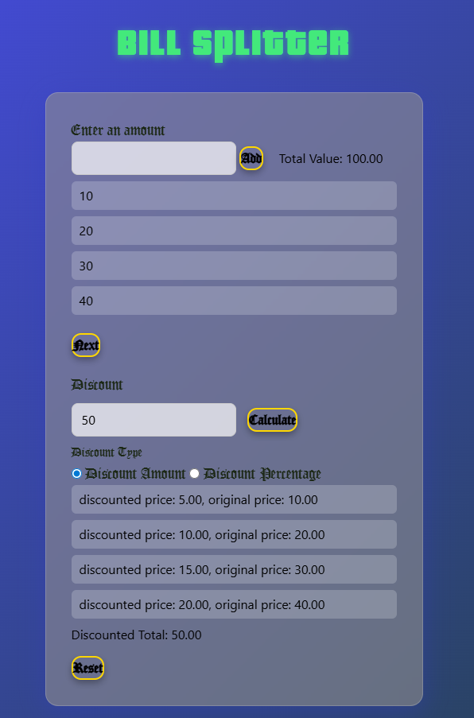

# Bill Splitter App

A stylish, interactive Bill Splitter web app with glassmorphism UI, GTA-inspired fonts, and discount calculation features.

## Features

- Add multiple item prices and see the running total.
- Apply a discount (fixed amount or percentage) to split the bill.
- See discounted prices for each item and the overall discounted total.
- Responsive, modern glassmorphism design with custom fonts and audio feedback.
- Input validation and helpful error/warning messages.

## Usage

1. Enter item prices in the input box and click "Add".
2. Click "Next" to open the discount section.
3. Choose discount type (amount or percentage), enter the value, and click "Calculate".
4. View discounted prices and the discounted total.
5. To reset, click "Reset".

## Tech Stack

- HTML5, CSS3 (custom + Tailwind), JavaScript (ES6+)
- No frameworks required; runs locally in any modern browser.

## Screenshots



## Setup

1. Clone the repo:
   ```sh
   git clone https://github.com/Shauryathanvi/bill-splitter-app.git